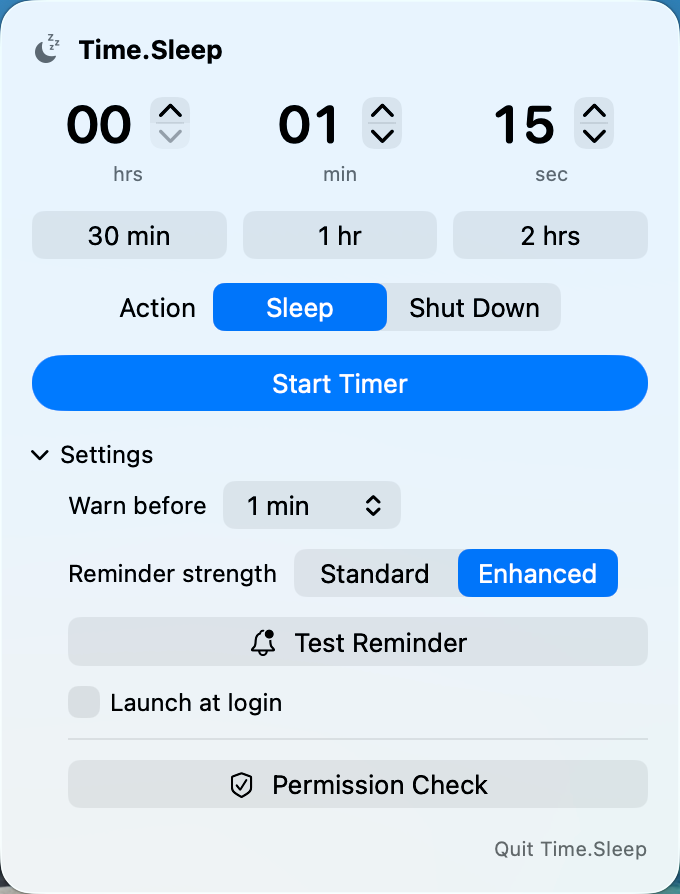

# Time.Sleep

[简体中文](README.zh-CN.md)

Time.Sleep is a small macOS menu bar timer that puts your Mac to sleep or shuts it down when the countdown ends. It stays out of the Dock, shows the remaining time in the menu bar, and warns you before the scheduled action.



## Features

- Sleep or shut down after a configurable countdown
- Hours, minutes, and seconds controls, plus 30-minute, 1-hour, and 2-hour presets
- Configurable advance warning from 30 seconds to 10 minutes
- Standard and enhanced reminders; enhanced mode uses a custom sound and a second reminder after 15 seconds
- Cancel, pause, resume, or postpone by 10 minutes from the panel
- Cancel or postpone directly from the notification
- Safe reminder preview that never triggers a power action
- Permission check for notifications, shutdown automation, and launch at login
- Optional launch at login
- Simplified Chinese, Traditional Chinese, and English
- Automatic light and dark appearance

Time.Sleep has no analytics and makes no network requests. Runtime logs stay on the Mac in `~/Library/Logs/Time.Sleep.log`.

## Requirements

- Apple Silicon Mac
- macOS 14 or later

## Download and install

1. Download both `Time.Sleep-<version>-macOS-arm64.zip` and its `.sha256` file from [Releases](../../releases).
2. Verify the download in Terminal:

   ```bash
   cd ~/Downloads
   shasum -a 256 -c Time.Sleep-<version>-macOS-arm64.zip.sha256
   ```

3. After the command reports `OK`, unzip the archive and move `Time.Sleep.app` to `/Applications`.
4. Open the app. A moon icon will appear in the menu bar; Time.Sleep does not show a Dock icon.

Current community builds are ad-hoc signed and are not notarized by Apple. macOS may block the first launch. If you trust the downloaded file and its checksum, try opening it once, then go to **System Settings → Privacy & Security** and choose **Open Anyway**. See [Apple's guidance for opening an app from an unidentified developer](https://support.apple.com/en-ie/102445). A Developer ID signed and notarized release is planned for the future.

## Use

1. Click the moon icon in the menu bar.
2. Set a duration or choose a preset.
3. Select **Sleep** or **Shut Down**.
4. Click **Start Timer**.

The menu bar displays the remaining time while the timer is active. The panel provides controls to pause, resume, cancel, postpone by 10 minutes, or perform the selected action immediately.

Open **Settings** in the panel to change the warning time and reminder strength, preview a reminder, check permissions, or enable launch at login.

### Permissions

| Feature | macOS behavior |
|---|---|
| Notifications | Requested the first time you start a timer or test a reminder |
| Sleep | Uses `/usr/bin/pmset sleepnow`; no root or Accessibility permission is requested |
| Shut down | Uses System Events and may request Automation permission the first time |
| Launch at login | Registered through macOS `SMAppService` after the app is installed in `/Applications` |

Gatekeeper, notification permission, and Automation permission are separate macOS controls. Disabling or overriding one does not grant the others.

## Build from source

Install Xcode or the Xcode Command Line Tools with Swift support. Clone the repository using the URL shown in GitHub's **Code** menu, then run:

```bash
cd Time.Sleep
scripts/build.sh
cp -R outputs/Time.Sleep.app /Applications/
```

The build script generates the icon and reminder sound, compiles the Swift source for Apple Silicon and macOS 14+, assembles the app bundle, and applies an ad-hoc signature.

Run the local verification suite with:

```bash
scripts/verify-local.sh --smoke-launch
```

The smoke launch uses dry-run mode and does not execute sleep or shutdown.

To create a local Release archive and checksum:

```bash
scripts/package-release.sh
```

## Safety notes

- A timer is kept in memory and is lost when Time.Sleep quits or the Mac logs out.
- If the Mac sleeps through the deadline by more than two minutes, Time.Sleep skips the action after wake instead of immediately sleeping or shutting down.
- If shutdown Automation permission is denied, enable Time.Sleep under **System Settings → Privacy & Security → Automation**.
- The app cannot override Focus, notification settings, mute state, or the system volume.
- Review the source and checksum before overriding Gatekeeper for an ad-hoc build.

## License

[MIT](LICENSE)

## Acknowledgements

Time.Sleep was shaped through hands-on use and small, practical iterations. Thanks to GPT-5.6 and GLM-5.3 for their help during development.
