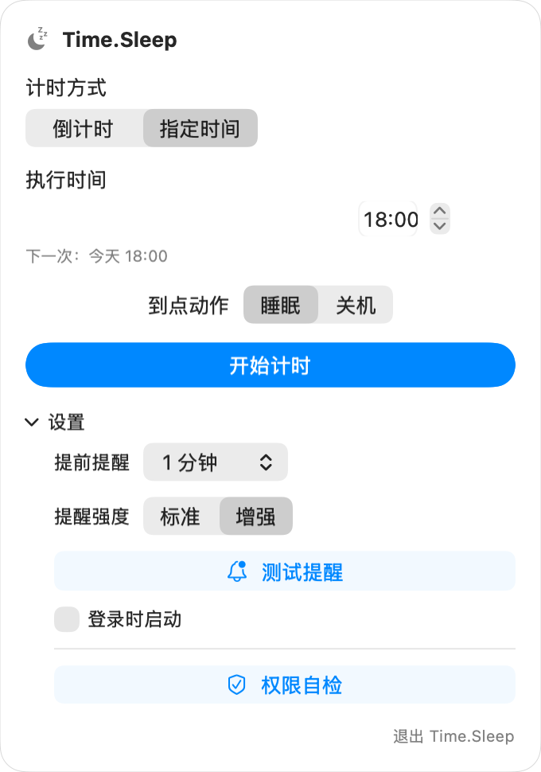

# Time.Sleep

[English](README.md)

Time.Sleep 是一个轻量的 macOS 菜单栏计时工具。它可以在倒计时结束后，或到达指定的本地时间时，让 Mac 进入睡眠或关机；运行时不占用 Dock，并在菜单栏显示剩余时间，在执行动作前发送提醒。



## 功能

- 倒计时结束后或到达指定本地时间时睡眠、关机
- 时间选择器跟随 Mac 的 12/24 小时制，并自动采用所选钟点的下一次出现时间
- 时、分、秒设置，以及 30 分钟、1 小时、2 小时快捷预设
- 可将提醒时间设置为提前 30 秒至 10 分钟
- 标准和增强两种提醒；增强模式使用自定义提示音，并在 15 秒后再次提醒
- 在面板中取消、暂停、继续或顺延 10 分钟
- 直接从通知中取消或顺延
- 安全的提醒预览，不会触发睡眠或关机
- 检查通知、关机 Automation 和登录启动状态
- 可选的登录时启动
- 简体中文、繁體中文和 English
- 自动适配浅色和深色外观

Time.Sleep 不包含数据分析，也不会发起网络请求。运行日志只保存在本机的 `~/Library/Logs/Time.Sleep.log`。

## 系统要求

- Apple 芯片 Mac
- macOS 14 或更高版本

## 下载与安装

1. 从 [Releases](../../releases) 下载 `Time.Sleep-<version>-macOS-arm64.zip` 和对应的 `.sha256` 文件。
2. 在终端中校验下载文件：

   ```bash
   cd ~/Downloads
   shasum -a 256 -c Time.Sleep-<version>-macOS-arm64.zip.sha256
   ```

3. 命令显示 `OK` 后，解压并把 `Time.Sleep.app` 移到 `/Applications`。
4. 打开 App，菜单栏会出现月亮图标；Time.Sleep 不显示 Dock 图标。

目前的社区构建使用 ad-hoc 签名，尚未经过 Apple 公证，因此 macOS 可能拦截首次启动。如果你确认下载来源和校验值可信，可以先尝试打开一次，再前往 **系统设置 → 隐私与安全性**，选择 **仍要打开**。可参考 [Apple 关于打开未知开发者 App 的说明](https://support.apple.com/zh-cn/guide/mac-help/-mh40616/mac)。未来计划提供 Developer ID 签名并经过公证的正式构建。

## 使用方法

1. 点击菜单栏中的月亮图标。
2. 选择 **倒计时** 并设置时长，或者选择 **指定时间** 并设置本地钟点。
3. 选择 **睡眠** 或 **关机**。
4. 点击 **开始计时**。

在 **指定时间** 模式下，尚未到达的钟点表示今天，已经过去的钟点表示明天。时间选择器会跟随 Mac 当前的地区设置和 12/24 小时制。计时一旦开始，目标就会转换为连续倒计时，因此之后修改系统时钟或时区，不会意外缩短或延长剩余时长。

计时过程中，菜单栏会显示剩余时间，面板也会显示预计执行的本地时间。面板中可以暂停、继续、取消、顺延 10 分钟，或立即执行当前动作。

展开面板中的 **设置**，可以调整提前提醒时间和提醒强度、预览提醒、检查权限，或者开启登录时启动。

### 权限说明

| 功能 | macOS 行为 |
|---|---|
| 通知 | 第一次开始计时或测试提醒时申请 |
| 睡眠 | 使用 `/usr/bin/pmset sleepnow`，不会申请 root 或辅助功能权限 |
| 关机 | 通过“系统事件”执行，首次使用时可能申请 Automation 权限 |
| 登录启动 | App 安装到 `/Applications` 后，通过 macOS `SMAppService` 注册 |

Gatekeeper、通知权限和 Automation 权限是相互独立的 macOS 控制项，放开其中一个并不会自动授予其他权限。

## 从源码构建

安装带 Swift 的 Xcode 或 Xcode Command Line Tools。使用 GitHub **Code** 菜单中显示的地址克隆仓库，然后运行：

```bash
cd Time.Sleep
scripts/build.sh
cp -R outputs/Time.Sleep.app /Applications/
```

构建脚本会生成图标和提醒音、为 Apple 芯片及 macOS 14+ 编译 Swift 源码、组装 App，并添加 ad-hoc 签名。

运行本地验证：

```bash
scripts/verify-local.sh --smoke-launch
```

启动检查使用 dry-run 模式，不会执行睡眠或关机。

生成本地 Release 压缩包和校验文件：

```bash
scripts/package-release.sh
```

## 安全说明

- 计时只保存在内存中；退出 Time.Sleep 或注销后，尚未完成的计时会丢失。
- 计时开始后修改系统时钟或时区，不会改变剩余时长；面板显示的预计本地执行时间会相应更新。
- 如果所选本地时间恰好因夏令时切换而不存在，Time.Sleep 会采用下一个有效的本地时间；如果同一钟点出现两次，则采用第一次。
- 如果 Mac 在休眠中错过计时终点超过两分钟，Time.Sleep 会在唤醒后跳过动作，避免立即睡眠或关机。
- 如果关机 Automation 权限被拒绝，请前往 **系统设置 → 隐私与安全性 → 自动化** 重新允许。
- App 无法绕过专注模式、通知设置、静音状态或系统音量。
- 对 ad-hoc 构建覆盖 Gatekeeper 前，请先核对源码和校验值。

## 许可证

[MIT](LICENSE)

## 致谢

Time.Sleep 是在实际使用中一点点打磨出来的。感谢 GPT-5.6 和 GLM-5.3 在开发过程中的协助。
